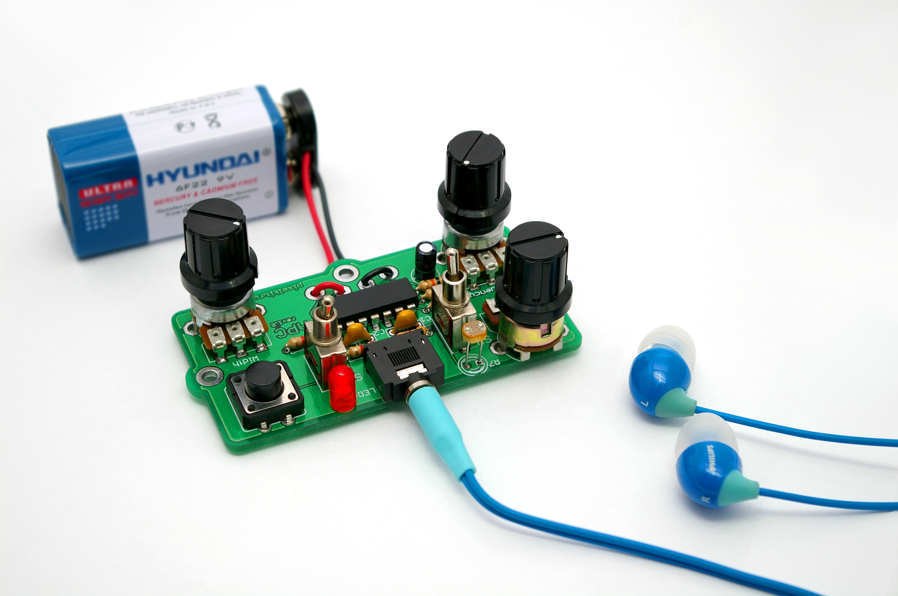
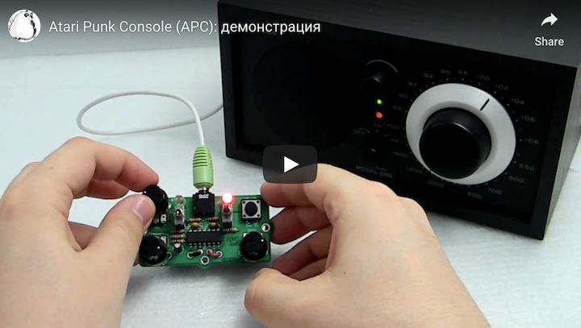
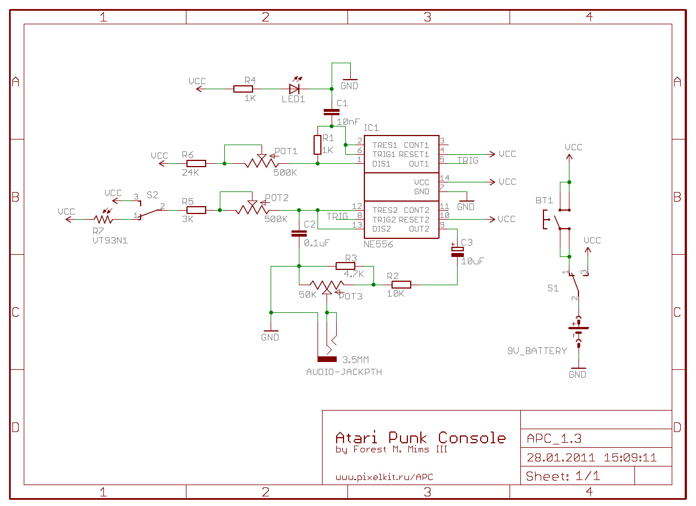

# Atari Punk Console
Yet another [Atari Punk Console](https://en.wikipedia.org/wiki/Atari_Punk_Console) circuit implementation. Original hardware was made by Forrest M. Mimms III in 80s.

This version based NE556 timer, packed with photoresistor, momentary pushbutton and shifted work range. All schematics and 2-sided layout are in [Autodesk Eagle](https://www.autodesk.com/products/eagle/features) format. GERBER files are also available.

### Demo on Youtube

### Schematics 

### Bill of materials

| Name | Details | Notes |
| --- | --- | --- |
| IC1 | [NE556N](http://www.st.com/stonline/books/pdf/docs/2183.pdf) timer IC | DIP-14 package |
| POT1, 2 | Potentiometer 500K | linear, thru-hole |
| POT3 | Potentiometer 50K | linear, thru-hole |
| S1, 2 | ON-ON switch | SS9, common middle contact |
| BT1 | Push button | thru-hole |
| R1, R4 | 1K resistor |  |
| R2 | 10K |  |
| R3 | 4K7 |  |
| R5 | 3K |  |
| R6 | 24K |  |
| R7 | VT93N1 photoresistor |  |
| C1 | 10nF capacitor | ceramic |
| C2 | 0.1uF | ceramic |
| C3 | 10uF | electrolytic |
| LED1 | It's LED |  |  
| AUDIO | Stereo socket ST-111 | 3.5mm jack |
| 9V-BAT | 9V battery holder | with wires |

### Notes
This project old af. Be polite.

